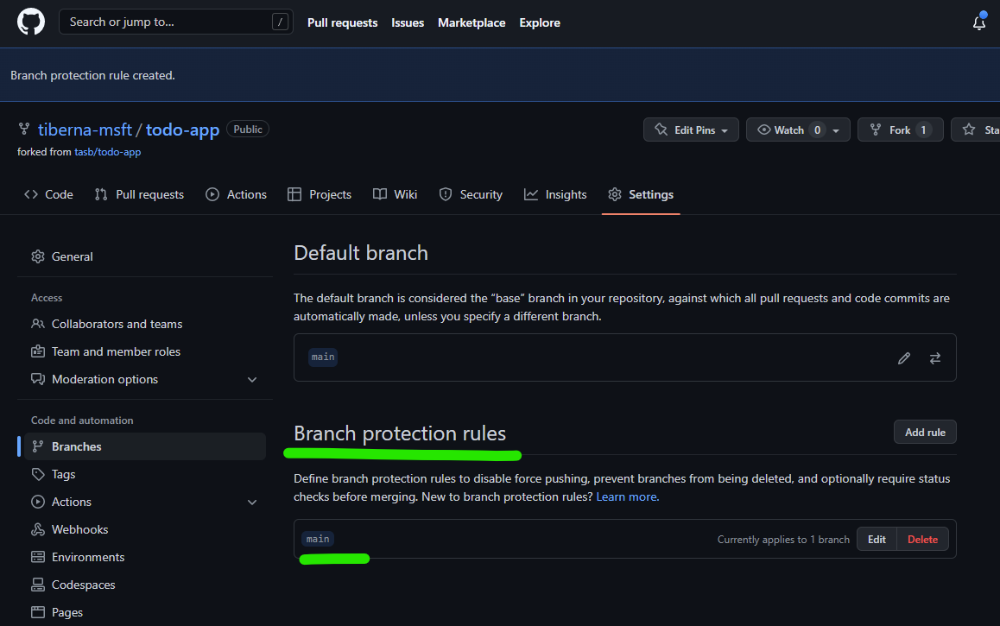

# Lab 01 - Build Lab Environment from Scratch

## Table of Contents

- [Description](#description)
- [Prerequisites](#prerequisites)
- [Guide](#guide)
  - [Step 01: Create a new GitHub repository](#step-01-create-a-new-github-repository)
  - [Step 02: Clone and initialize the repository](#step-02-clone-and-initialize-the-repository)
  - [Step 03: Define GitHub Repo policies](#step-03-define-github-repo-policies)
  - [Step 04: Configure Service Principal in Azure](#step-04-configure-service-principal-in-azure)
  - [Step 05: Create GitHub Environments](#step-05-create-github-environments)
  - [Step 06: Create Azure Storage](#step-06-create-azure-storage)
  - [Step 07: Review your repository](#step-07-review-your-repository)
  - [Step 08: Create a new issue](#step-08-create-a-new-issue)
  - [Step 09: Create a new branch](#step-09-create-a-new-branch)
  - [Step 10: Change Terraform code](#step-10-change-terraform-code)
  - [Step 11: Change your app code](#step-11-change-your-app-code)
  - [Step 12: Commit your changes](#step-12-commit-your-changes)
  - [Step 13: Create a Pull Request](#step-13-create-a-pull-request)
  - [Step 14: Deploy to Azure](#step-14-deploy-to-azure)
- [Conclusion](#conclusion)

## Description

This lab will guide you through the process of creating a lab environment from scratch.

On this lab, you will:

- Create a new GitHub repository
- Define GitHub Repo policies to enforce branch protection and Pull Request reviews
- Use GitHub Actions to automate the build of a simple dotnet application
- Use CodeQL to scan the code for vulnerabilities
- Use Terraform to create an Azure Environment
- Use GitHub Actions to deploy the application to Azure

## Prerequisites

- GitHub account
- Az CLI installed ([Download](https://docs.microsoft.com/en-us/cli/azure/install-azure-cli))

## Guide

### Step 01: Create a new GitHub repository

Navigate to [GitHub](https://github.com) and login to your account.

Create a new repository with the following settings:

- Repository name: `echo-app`
- Description: `Simple echo app`
- Public
- Add a README file
- Add a .gitignore file for `VisualStudio`

### Step 02: Clone and initialize the repository

Clone the repository to your local machine and initialize it with a new dotnet application.

```bash
git clone <your-repo-url>
cd echo-app
````

Download the dotnet application template from [here](https://github.com/tasb/echo-app-demo/archive/refs/tags/v1.0.zip) and extract it to the root of the repository.

Now you should push the changes to the repository.

```bash
git add -A
git commit -m "Initial commit [skip ci]"
git push
```

It is important to add `[skip ci]` to the commit message to avoid triggering the GitHub Actions workflow.

### Step 03: Define GitHub Repo policies

Before starting change your repo, let's add some policies to enforce Pull Requests on `main` branch and enable Issues on your repo.

Click on `Settings` option on tool bar as shown on next image.


On main screen, check the `Issues` option to enable GitHub Issues on your repo.


Next navigate to `Branches` option available on the left side option, under block `Code and Automation`. On that screen click on `Add rule` button as shown on next image.


On new screen, add `main`on `Branch name pattern`. This option will enable this policy on `main` branch, meaning that all merges (updates) on that branch must came from a Pull Request.

You need to enable the option `Require a pull request before merging` to enable the policy. You need to **disable** `Required approvals` option, since you're the only user on that repo and by default, GitHub don't allow that the creator of a pull request can approve his own changes.

At the end, your rule must have the following details.


After making this configuration, you need to click on `Create` green button on the bottom of this page. You may need to enter again your password to confirm this change. After you do that you must see a similar screen like the one below.



Now you're ready to change your code!

### Step 04: Configure Service Principal in Azure

On this lab, we'll use better option to integrate GitHub Workflows with Azure, that is using a workload identity integrated with GitHub.

First, you need to install Az CLI on your machine. You can find the instructions [here](https://docs.microsoft.com/en-us/cli/azure/install-azure-cli).

Then, you need to login Az CLI on Azure. For that, run this command:

```bash
az login --use-device-code
```

This command will output something like this:

```bash
To sign in, use a web browser to open the page https://microsoft.com/devicelogin and enter the code XXXXXX to authenticate.
```

Follow the instructions and login with your Azure account, using the username and password provided to you by IT support team.

Now, you can create an App Registration that is an object on Azure Active Directory that represents your application.

You need to be careful naming your resources, since everyone is sharing some subscription, so let's use first letter of your first name and your last name to identify your resources, using it as prefix.

On my case, my prefix is `tbernardo`.

For that, run this command:

```bash
az ad app create --display-name <PREFIX>-github-workflow
```

You should get an JSON outcome. Please copy the `appId` (referenced as `<APP_ID>` in following commands) and `Id` (referenced as `<OBJECT_ID>` in following commands) value, since you'll need it later.

Now create a JSON file named `policy.json` and add the following content on it:

```json
{
  "name": "gh-repo",
  "issuer": "https://token.actions.githubusercontent.com",
  "subject": "repo:<GH-USERNAME>/<GH-REPO>:ref:refs/heads/main",
  "audiences": [
    "api://AzureADTokenExchange"
  ]
}
```

On the file you should replace the following tokens:

- GH-USERNAME, with your GitHub username
- GH-REPO, with your GitHub repository name

This file will be used to create a Federated Credential between your Azure AD (through your App Registration) and your GitHub repository and allow only the workflows on your repository to use the credentials created on this App Registration.

Don't delete this file because you'll need to use it again on next lab.

Now, execute the following command to create a credential on your App Registration (look at the diferences if you're using Powershell or bash/zsh).

Bash/Zsh version:

```bash
az ad app federated-credential create --id <OBJECT_ID> --parameters @policy.json
```

PowerShell version:

```bash
az ad app federated-credential create --id <OBJECT_ID> --parameters "policy.json"
```


Finally, you need to create a Service Principal, the service account that will effectively do the login in Azure on behalf of your GitHub workflow.

For that, run the following command:

```bash
az ad sp create --id <APP_ID>
```

Next step is to add a proper role to this Service Principal, so it can create resources on Azure.

On this lab, we'll use the `Contributor` role, that allows the Service Principal to create, update and delete resources on all Subscription. On the real world, you should use a more restrictive role, but since we are creating everything from the scratch, we'll use this role.

For that, run the following command:

```bash
az role assignment create --assignee <APP_ID> --role Contributor --scope "/subscriptions/XXX"
```

Last step, is to make this details available on GitHub repository, so the workflows can use it.

To do that you'll use 3 secrets, to store the values in a secure way.

Go to your repo and navigate to `Settings > Secrets and variables > Actions`, then click on `New repository secret` and add the following secrets (you need to repeat this step 3 times):

- Secret #1
  - Name: AZURE_CLIENT_ID
  - Secret: <APP_ID>
- Secret #2
  - Name: AZURE_TENANT_ID
  - Secret: XXX
- Secret #3
  - Name: AZURE_SUBSCRIPTION_ID
  - Secret: XXX

### Step 05: Create GitHub Environments

Let's create the environments to be used by your CD pipeline.

Navigate to `Settings > Environments` and click on `New environment`.

First, you may create Staging environment. On environment name add `uat` and click on `Configure environment`.

On the new screen, click on the `Add Secret` link at the end the screen and fill the form with the following parameters:

- Name: `DB_PASSWORD`
- Value: `P@ssw0rd`

Finally, let's create Production environment. Repeat the process clicking on `New environment` button and set environment name as `prod`.

On the new screen, click on the `Add Secret` link at the end the screen and fill the form with the following parameters:

- Name: `DB_PASSWORD`
- Value: `P@ssw0rd`

In order to better protect this environment, you will add two protection rules to it.

On `Deployment protection rules` block, enable `Required reviewers` checkbox and add your GitHub username on the input box.

You need to click on `Save protection rules` to save this setting. Any other setting don't need to be explicit saved.

Doing this you are creating a pre-approval gate on your production environment, meaning someone (on this case, you) need to explicitly approve the deployment on the production environment.

Then, on `Deployment branches` block, click on the dropdown and select `Selected branches` option. Now you need to define from which repo branch are you allowed to deploy to this environment.

Click on `Add deployment branch rule` and set `main` on `Branch name pattern:` input box.

### Step 06: Create Azure Storage

You need an Azure Storage to keep your Terraform state to be used when you execute your pipeline and have access to last know state created by Terraform tool.

Navigate to [Azure Portal](https://portal.azure.com/) and login with your  credentials.

On top search box, search for `Storage Accounts` and click on the result with the same name as stated on following image.


Then you may click on `Create storage account` button in the middle of the page.


You start the wizard to create your Storage Account. You need to configure 3 fields:

1) Resource Group
   - Click on the link `Create new` below dropdown box
   - On resource group name add `<your-prefix>-tfstate-rg`
   - Click on `OK`
2) Storage account name
   - Storage accounts on Azure need to have an unique on ALL Azure subscription
   - Name is mandatory to be all in small caps
   - Add the following name `<your-prefix>tfstatestg`
3) Region
   - Select `West Europe`

Click on `Review + Create` button for Azure Resource Manager validate your configuration.

After that validation finished successfully, `Create` button will turn blue and you may click on it.

The process to create your storage account just started and you need to wait a couple of minutes until have access to your resource.

When the creation finished with success you get a screen like this.


To finalize this configuration, you need to create a container inside your Azure Storage Account.

A container can be seen as a folder and is where Terraform state files will be stored.

Click on `Go to resource` blue button and you get access to all details and configurations of your Azure Storage.

Click on `Containers` option on left side bar, then on `+ Container` and finally add `tfstate` as container name and select `Blob (anonymous read access for blobs only)` as `Public access level` and to finalize click on `Create` button.


Now you have everything ready to start to implement your Infra as Code scripts and update (or create) your workflows.

### Step 07: Review your repository

Now, you need to review your repository to check if everything is set up correctly.

This repo have 4 folders:

- `.github/workflows`: This folder contains the GitHub Actions workflows that will be used to build and deploy your application.
- `deploy`: This folder contains the Terraform code that will be used to create the Azure resources.
- `echo-api`: This folder contains the `echo-api` application that will be deployed to Azure.
- `echo-webapp`: This folder contains the `echo-webapp` application that will be deployed to Azure.

On the `.github/workflows` folder, you have 4 files:

- `codeql.yml`: This workflow will scan your code for vulnerabilities using CodeQL.
- `echo-api.yml`: This workflow will build and deploy the `echo-api` application and infra to Azure.
- `echo-webapp.yml`: This workflow will build and deploy the `echo-webapp` application and infra to Azure.
- `issue.yml`: This workflow will update an issue on your repository setting `triage` label on it when a new issue is created.

Take same time to review the content of each file and understand what each one does. On workflows, check how the triggers are set up and how the jobs are defined.

Review that there is some steps that will be executed based on conditions, life if the trigger is a pull request or a push on a specific branch.

### Step 08: Create a new issue

As a good practice you should always have a work item to support any change on your code. On GitHub that is done using GitHub Issues.

The change you will do is to create a pull request template to allow you to created a better and formatted pull request description.

Start to navigate to `Issues` option on top of your repo.

Then click on `New Issue` button and use the following details on your issue:

- Title: `Update Echo-App`
- Description: `Change title on webpage and add a token on echo reply`
- Assignee: `Yourself`

Then click on `Submit new issue` button and your issue will be created. After that you may see a screen where you may have a conversation about this issue with another members of your team.

To see your newly created issue on the list, you may click on `Issue` option that your clicked previously.

This issue will describe changes on the components of your application. This is done for demo purpose but on real world you should have two issues, one for each component.

### Step 09: Create a new branch

Now, you need to create a new branch to work on your issue.

On your local machine, run the following command:

```bash
git checkout -b topic/update-echo-app
```

This command will create a new branch named `topic/update-echo-app` and switch to it.

### Step 10: Change Terraform code

You need to update the Terraform code to use the Storage Account that you created on step 06.

Edit file `deploy/terraform/echo-api/main.tf` and find the following code:

```hcl
terraform {
  backend "azurerm" {
        resource_group_name  = "tf-storage-rg"
        storage_account_name = "echoapptfbackend"
        container_name       = "tfstate"
        key                  = "terraform.tfstate"
  }
}
```

You need to update to:

```hcl
terraform {
  backend "azurerm" {
        resource_group_name  = "<your-prefix>-tfstate-rg"
        storage_account_name = "<your-prefix>tfstatestg"
        container_name       = "tfstate"
        key                  = "terraform.tfstate"
    }
}
```

You need to do the same on file `deploy/terraform/echo-webapp/main.tf`.

### Step 11: Change your app code

Edit file `echo-webapp/Pages/Shared/_Layout.cshtml` and find line 27.

Change the year `2022` to `2024`.

Then, edit the file `echo-app-demo/echo-api/Program.cs` and find line 60.

Change the following line:

```csharp
string logMessage = string.Format("Echoing message: {0}", message);
```

To:

```csharp
string logMessage = string.Format("Echoing message: {0} - {1}", message, Guid.NewGuid().ToString());
```

Don't forget to save both files.

### Step 12: Commit your changes

Now, you need to commit your changes to your branch.

Run the following commands:

```bash
git add -A
git commit -m "Update Echo-App #1"
git push --set-upstream origin topic/update-echo-app
```

This will commit your changes to your branch and push it to your repository.

On the commit message, you should always reference the issue number that you're working on. This will link the commit to the issue and will help you to track the changes that were made to solve that issue.

Please confirm that the issue id is the same that you created on step 7.

### Step 13: Create a Pull Request

Now, you need to create a Pull Request to merge your changes to the `main` branch.

Navigate to your repository on GitHub and click on `Pull requests` option on the top of the page.

Then click on `New pull request` button.

On the new screen, you need to select the branch that you want to merge to `main` branch.

On the `base` dropdown, select `main` branch and on the `compare` dropdown, select your branch `topic/update-echo-app`.

After that, click on `Create pull request` button.

Now that you have created the pull request, you may check that several checks are being executed on your code. This is done by GitHub Actions, that is running the workflows that you have created.

After all checks are done, you may click on `Merge pull request` button to merge your changes to the `main` branch.

Don't forget to delete your branch after merging it.

### Step 14: Deploy to Azure

After merging your changes to the `main` branch, you should see that the `echo-webapp` and `echo-api` workflows are being executed.

These workflows will build your applications and deploy them to Azure.

You may check the progress of the workflows on the `Actions` tab on your repository.

The worklows will create automatically the UAT environment and deploy the applications to it.

When the workflows are doe with UAT environment, you may check if the applications are working as expected.

If you check everything is ok, you may go to the `Environments` tab on your repository and promote the UAT environment to the Production environment, approving the deployment.

## Conclusion

On this lab, you have learned how to create a lab environment from scratch.
You've created a new GitHub repository, defined GitHub Repo policies, used GitHub Actions to automate the build of a simple dotnet application, used CodeQL to scan the code for vulnerabilities, used Terraform to create an Azure Environment, and used GitHub Actions to deploy the application to Azure.
